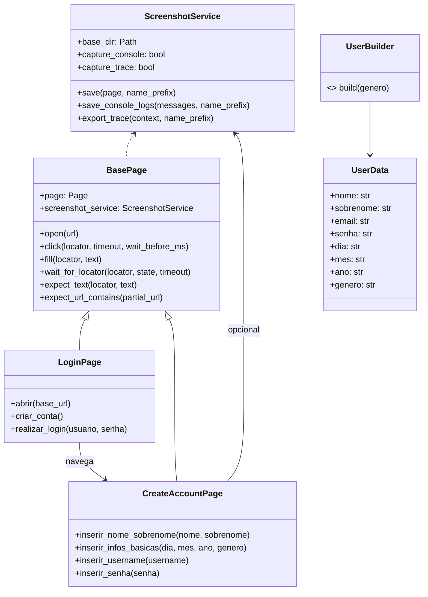

# Diagrama de Classes

```mermaid
classDiagram
    class ScreenshotService {
        +base_dir: Path
        +capture_console: bool
        +capture_trace: bool
        +save(page, name_prefix)
        +save_console_logs(messages, name_prefix)
        +export_trace(context, name_prefix)
    }

    class BasePage {
        +page: Page
        +screenshot_service: ScreenshotService
        +open(url)
        +click(locator, timeout, wait_before_ms)
        +fill(locator, text)
        +wait_for_locator(locator, state, timeout)
        +expect_text(locator, text)
        +expect_url_contains(partial_url)
    }

    class LoginPage {
        +abrir(base_url)
        +criar_conta()
        +realizar_login(usuario, senha)
    }

    class CreateAccountPage {
        +inserir_nome_sobrenome(nome, sobrenome)
        +inserir_infos_basicas(dia, mes, ano, genero)
        +inserir_username(username)
        +inserir_senha(senha)
    }

    class UserBuilder {
        <<static>> build(genero)
    }

    class UserData {
        +nome: str
        +sobrenome: str
        +email: str
        +senha: str
        +dia: str
        +mes: str
        +ano: str
        +genero: str
    }

    BasePage <|-- LoginPage
    BasePage <|-- CreateAccountPage
    ScreenshotService <.. BasePage
    UserBuilder --> UserData
    LoginPage --> CreateAccountPage : navega
    CreateAccountPage --> ScreenshotService : opcional
```
